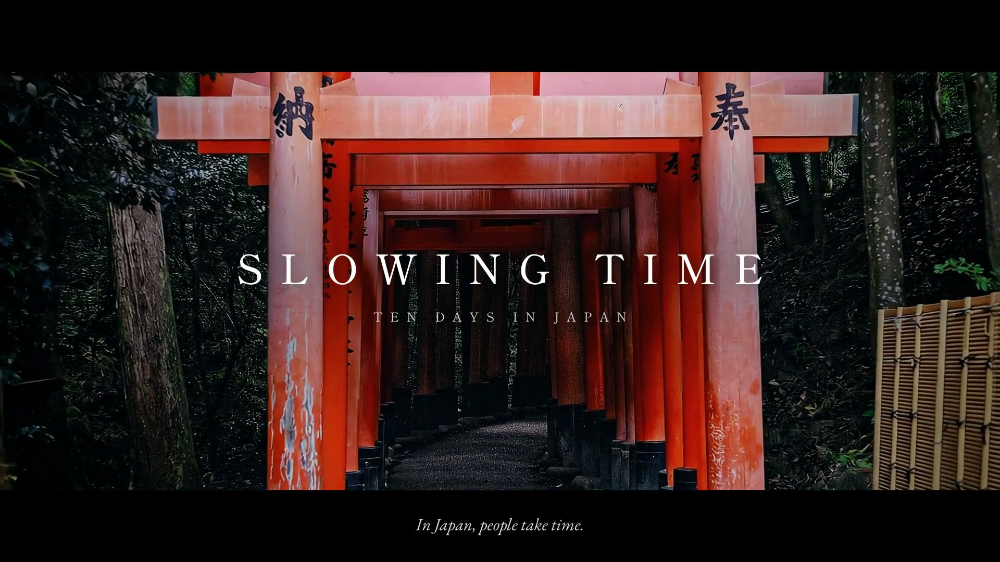
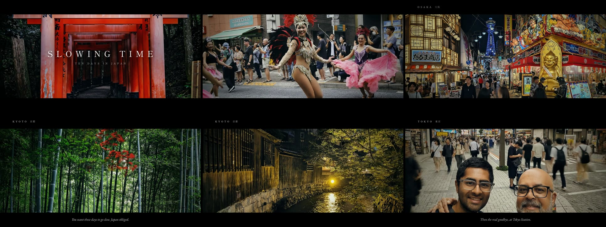

# Video Art Studio

**A Claude Code plugin that turns your ideas and photographs into finished videos.**

You describe what you want in plain words. Claude writes the script, paints the pictures,
records the voice, adds music and captions, edits it all together, then watches the result
and fixes what looks wrong.

[](docs/showcase/slowing-time-60s.mp4)

**▶ [Watch "Slowing Time" (63 s)](docs/showcase/slowing-time-60s.mp4)**: made from one folder of
trip photos and a blog post, with the steps below. [How it was made ↓](#showcase-how-slowing-time-was-made)

---

## What is it? (the five-year-old version)

Imagine a small film studio living inside your computer:

| In a real studio… | In Video Art Studio… | Models it uses (**default** first) |
|---|---|---|
| a **director** plans every shot | Claude writes the script, storyboards the shots, and keeps the look consistent | **the Claude model you run Claude Code with** (Opus 5.5 recommended) |
| an **illustrator** paints scenes | an AI image model paints the stills, matching one approved style frame | **Gemini 3 Pro Image** · GPT Image 5.4 · Gemini 3.1 Flash Image (cheap drafts) · Higgsfield *(optional)* |
| a **camera crew** films moving shots | an AI video model turns one of your photos into a short moving clip | Films: **Veo 3.1 Fast** (1080p) · **Veo 3.1** for hero shots. Also Seedance 2.5 (great motion, 720p max) · Veo 3.1 Lite (cheap tests) · Kling 3.0 · Higgsfield *(optional)* |
| a **motion designer** animates titles and graphics | code animates type, charts, maps, and collage layers | **HyperFrames** (HTML + GSAP, rendered in Chrome), no AI model or fees |
| a **narrator** reads the script | a voice model reads it, with the emotion you ask for | **Gemini 3.8 Flash TTS**, voice *Charon* (try Kore, Puck, Zephyr) |
| a **composer** writes the score | a music model writes an instrumental bed | **Lyria 3 Clip** (≤30s) · Lyria 3 Pro (longer) · ElevenLabs Music v2.5 *(paid plan)* |
| a **captioner** times every word | speech recognition finds when each word is spoken | **whisper.cpp** `base.en`, runs on your Mac |
| an **editor** cuts it together | cuts every shot on the music's beat, grades them to one look, lowers the music under the voice | **ffmpeg** + a beat detector, plus an OpenTimelineIO file you can open in Resolve or Premiere |
| a **critic** watches the first cut | looks at frames, measures loudness, and checks the words heard match the script | **Claude** + whisper.cpp + ffmpeg |

Images, video and music all run through one OpenRouter key, and narration uses a Gemini key.
The model choices live in `config/models.toml`. Change them there, or per project in
`.video-art/models.toml`. Run `make models` to see every model currently available.

You stay the artist. You decide what it's about, how it should feel, and whether each draft is good enough.

## What can I make with it?

**If you have a folder of photos, clips and notes** (a trip, a wedding, a launch, a blog post)
- *Cinematic films:* point Claude at the folder. It studies everything, asks you a few questions
  (length, theme, style, voice, budget), then animates your best photos into moving shots, scores
  them, cuts on the beat, grades, titles, and mixes a finished film. See the [guide](#guide-make-a-film-from-a-folder).

**If you're a photographer**
- *Living photos:* water keeps flowing and clouds keep drifting while the rest of your photo stays exactly as you shot it. Each one loops forever.
- *Photo stories:* a shoot becomes a paced slideshow with slow camera moves, captions, and music cut to the beat.
- *Parallax:* your subject lifts off the background with a gentle 3-D feel.
- *Portfolio reels* in 9:16 for Reels, 4:5 for Instagram, or 16:9 for your site.

**If you're an illustrator, designer, or painter**
- *Narrated explainers* in a signature style, such as "newspaper-cutout collage, torn edges, halftone".
- *Generative loops:* flow fields, particles, and shader art that repeat seamlessly for screens and exhibitions.
- *Motion graphics:* animated titles, maps, and data pieces.

## How do I use it?

After installing (below), open Claude Code in a folder and just ask:

```
/video-art:film ~/Pictures/japan-trip
```
```
make a 30-second living-photo loop from the pictures in ~/Pictures/iceland, 4:5 for Instagram
```
```
/video-art:new a 60-second explainer on the history of the printing press, paper-collage style
```
```
make an abstract 20-second generative loop of ink diffusing in water, deep indigo and gold, 1:1
```

Claude then works in stages and checks in with you at each one:

1. **Brief.** A few questions: shape, length, look, and budget.
2. **Look.** One style frame for you to approve.
3. **Animatic.** A rough cut built from stills and voice. It costs almost nothing, and you approve it before any money goes to AI video.
4. **Final.** AI motion, music, and captions are added.
5. **Critic.** Claude reviews its own cut and fixes problems before showing you.

Everything for a piece lives in `projects/<name>/`. The finished video is in `projects/<name>/out/`.

### Commands

| Type this | What it does |
|---|---|
| `/video-art:setup` | First-time setup: checks your tools and keys, then makes a 5-second test video |
| `/video-art:film <folder>` | **Film wizard:** analyses a folder of photos, videos and text, asks a few questions, then makes a cinematic film |
| `/video-art:new [idea]` | Starts a new piece with a short questionnaire |
| *just describe it* | Claude picks the right workflow: explainer, photo motion, or generative |

## What does it cost?

The plugin is free. The AI services charge per use, and you can make a lot without spending anything:

| Thing | Rough cost |
|---|---|
| Photo slideshows, camera moves, parallax, titles, generative loops | **free** (runs on your Mac) |
| One AI still image | about $0.01–0.10 |
| One minute of narration | a few cents |
| A music track | $0.04 for a 30-second clip, $0.08 for a full-length piece (Lyria) |
| One AI video clip | 6 s at 1080p: $0.60 (Veo 3.1 Fast) · 8 s: $1.60 (Veo 3.1) · 720p tests from $0.15 |
| **A 60-second cinematic film** (9 animated shots, score, voice) | **about $7–9**; "Slowing Time" cost $7.90 |

Claude never spends money on AI video silently. It prints the estimated cost of each shot, adds them up, and waits for your OK. It also builds a cheap rough cut first, so you never pay to animate a shot you'd have cut anyway.

---

## Guide: make a film from a folder

What you need: a folder with photos (and optionally short videos and any text: a blog post,
notes, captions). Phone photos are fine.

```
/video-art:film ~/Pictures/japan-trip
```

**1. Claude studies your material (free).** `va-ingest` copies the folder into
`projects/<name>/`. Photos are straightened, colour-corrected and **stripped of all metadata,
including GPS**. Your text is gathered, and numbered contact sheets are made. Claude looks at every
photo, reads every word, and tells you what it sees: the story, the strongest shots, which ones
have people in them, and any risks such as low resolution or text in the images.

**2. The wizard asks you (two short rounds).**

| Question | Choices |
|---|---|
| How long? | 30 s teaser · **60 s film** · 90 s · 2–3 min |
| What's it about? | 2–3 story angles drawn from *your* material, or your own words |
| Videography style? | `cinematic-warm` · `documentary-clean` · `vintage-film` · `neon-night` · `monochrome` |
| Shape? | 16:9 · 9:16 (Reels/TikTok) · 1:1 |
| Voice? | music only · **music + a few of your own lines** · full voiceover (pick a voice) |
| Music? | a proposed mood arc (quiet → build → peak → breath → resolve), or your own track |
| Budget? | lean ≈ $4–6 · **standard ≈ $7–9** · premium ≈ $12–15 |
| People? | **subtle motion only** (faces checked) · places only · fully animated |

**3. Storyboard (free).** Claude picks 8–12 shots and writes them into one file, `film.json`:
photo, crop, camera move, model, spoken lines. `va-film plan` shows the shot table and the real
cost. **Nothing is spent until you approve it.**

**4. Frames, then two test shots.** `va-film frames` crops landscape photos and extends portrait
photos to the film's shape. The image model only paints the *sides*, and your original photo is
pasted back exactly in the middle. Two test shots are generated first (about $2). Claude checks
them for invented text and for faces that drift, and shows you. Then the rest are made.

**5. Score and voice.** `va-film score` composes an original score, records your lines, and
finds the beat and the music's sections (build, peak, breath, resolve).

**6. The edit follows the music.** Every cut lands on a beat. Energetic shots go in the peak,
slow-motion shots in the breath, the emotional shot on the swell. The film ends on its first
frame, so it loops.

**7. Cut, check, deliver.** `va-film cut` grades every shot to the chosen style and adds the
letterbox, title, place names, subtitles and transitions. It lowers the music under each spoken
line, mixes to streaming loudness (−14 LUFS), then runs the critic. Claude looks at every scene,
checks every spoken line can be heard, tells you honestly what the AI changed, and offers retakes.

Your film is in `projects/<name>/film/out/`. Want a vertical version? Change `aspect` to `9:16`
and re-run.

### Videography styles

| Style | Look |
|---|---|
| `cinematic-warm` | anamorphic letterbox, warm highlights and cool shadows, fine grain, elegant serif titles (the showcase) |
| `documentary-clean` | natural colour, full frame, modern sans-serif |
| `vintage-film` | faded warm stock, lifted blacks, heavy grain, classic serif |
| `neon-night` | deep contrast, cyan/magenta split-tone, bold grotesk titles |
| `monochrome` | black & white, rich contrast |

Presets live in `config/styles.toml`: a grade (an ffmpeg filter chain), grain, letterbox, fps and
fonts (open-licence fonts are downloaded on first use). Add your own.

## Showcase: how "Slowing Time" was made



**The material:** a Substack post about a father taking his son to Japan for a year of university
(10 days, Tokyo → Kyoto → Osaka), with 125 photos from a phone and a rented Fujifilm X100VI.

**First attempt: a slideshow.** A 10:47 photo essay: every one of the 125 photos framed on paper,
the whole post narrated. Well made, but it looked like a home video. That feedback shaped the
wizard.

**Second attempt: the film (63 s).**
- **Brief:** 60 s, 16:9, the `cinematic-warm` style, music-led with 5 of the author's own lines,
  subtle motion allowed on people, $6–9.
- **9 shots from 9 photos:** torii tunnel · the quiet Sangenjaya crossing · Gotokuji's lucky cats ·
  a samba parade · Osaka neon · the Shinkansen window · the Arashiyama bamboo · the Shirakawa canal ·
  father and son in Akihabara.
- **Portraits made wide:** 5 portrait photos were cropped to their best band and extended to 16:9;
  the originals were pasted back pixel-exact.
- **Motion:** Veo 3.1 for the torii and the goodbye, Veo 3.1 Fast for the rest, all at 1080p.
  **$7.40.**
- **Score:** one Lyria cue with an arc ($0.08). Cuts land on its 126 bpm grid, and the bamboo and
  canal play in slow motion during its quiet middle: *slowing time*, literally.
- **Honest notes:** the goodbye shot widened both smiles a little, and the torii clip invented kanji
  deeper in the tunnel. Only its first 3.2 s is used, slowed down, so the real 納 and 奉 dominate.
  The critic's whisper check caught the score masking "under my wing"; the score is now pre-ducked
  under every line.

Total: **about $7.90**. The whole film can be rebuilt from its `film.json` with `va-film cut`.

---

## Install

**You need:** a Mac, [Claude Code](https://claude.com/claude-code), and [Homebrew](https://brew.sh).

### Option A: one command

```bash
git clone https://github.com/usathyan/video-art-studio.git && bash video-art-studio/install.sh
```

This installs the helper tools (ffmpeg, whisper, uv, node, yt-dlp) and the plugin.

### Option B: from inside Claude Code

```
/plugin marketplace add usathyan/video-art-studio
/plugin install video-art@video-art
```

Then install the helper tools yourself with `brew install uv ffmpeg ffmpeg-full whisper-cpp yt-dlp node`, or run `/video-art:setup` and let Claude do it.

### Then, in any folder where you want to make art

```bash
mkdir -p ~/VideoArt && cd ~/VideoArt && claude
```
```
/video-art:setup
```

Setup walks you through the API keys, installs the motion-graphics engine into that folder, and makes a test video so you can see everything works.

### API keys: what each one is for

| Key | Needed for | Get it at |
|---|---|---|
| **OpenRouter** | AI images, AI video and music (one key covers Gemini, GPT Image, Seedance, Veo, Kling, Lyria…) | openrouter.ai/keys |
| **Gemini** | narration | aistudio.google.com/apikey |
| **ElevenLabs** *(optional)* | alternative music engine. Needs a **paid** plan (the music API isn't on the free tier). Use the secret key starting `sk_`, not the key ID | elevenlabs.io → API keys |

The easiest place to enter them is `/plugin` → **Video Art Studio** → **Configure**. They're stored in your system keychain. You can also put them in your shell profile or in `~/.config/video-art/.env`.

A ChatGPT Plus subscription isn't needed. OpenAI's image models are reachable through the OpenRouter key.

---

## What's inside (for the curious)

```
.claude-plugin/     plugin + marketplace manifests
skills/             how Claude should direct each kind of piece
  video-director/     narrated explainers: script → storyboard → animatic → final
  photo-motion/       your photographs, brought to life without altering them
  generative-art/     code-driven abstract and looping pieces
  film/               the film wizard: folder → analysis → questions → storyboard → film
  new/  setup/        the other two slash commands
bin/va-*            small command-line tools Claude calls (on PATH while the plugin is on)
tools/*.py            …their Python source:
                      ingest (folder → clean media + contact sheets) · reframe (crop / outpaint)
                      film (plan · frames · shots · score · cut) · beats (tempo + sections)
                      image · video · tts · music · clips · assemble · captions · critic
config/styles.toml  videography style presets (grade, grain, letterbox, fonts)
templates/film.example.json  a complete film spec (the showcase, generalised)
config/models.toml  which AI models to use; change them here or per project in .video-art/models.toml
templates/brief.md  the brief every piece starts from
docs/research.md    where these ideas came from, with sources
```

The motion-graphics engine is [HyperFrames](https://github.com/heygen-com/hyperframes) by HeyGen (Apache-2.0). Setup installs it into each art folder; it isn't bundled here.

### Developing the plugin

```bash
make install      # python + bun deps
make test lint    # unit tests + ruff
make smoke        # end-to-end check: 1 image + 1 voice line, no video spend
claude --plugin-dir .   # try local changes without reinstalling
```

## Credits

The workflow builds on posts by [@deedydas](https://x.com/deedydas/status/2104957026199900220)
and [@maxescu](https://x.com/maxescu/status/2104898184442962277). See [docs/research.md](docs/research.md)
for every source.

MIT licensed.
